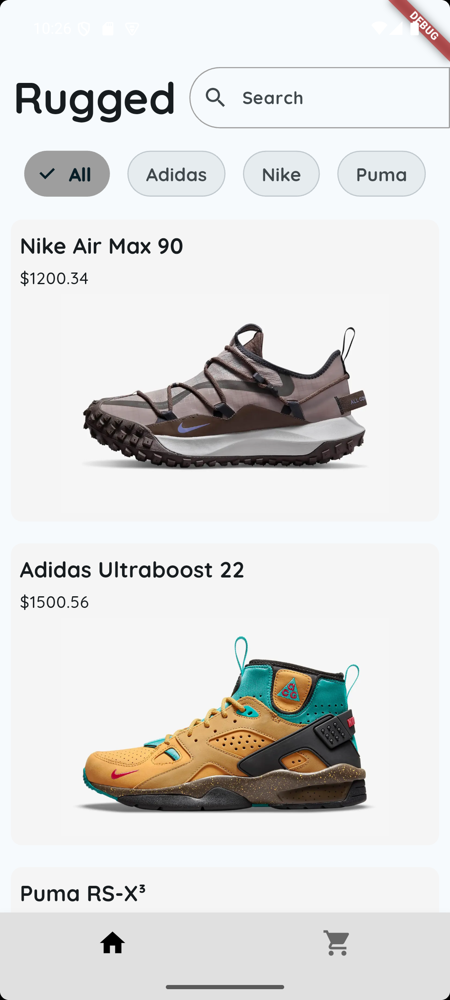
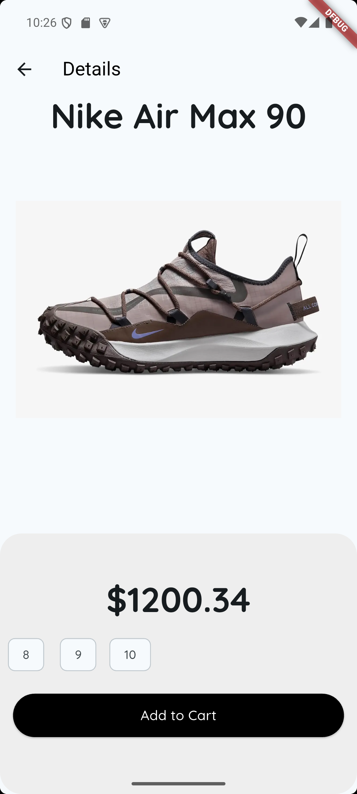
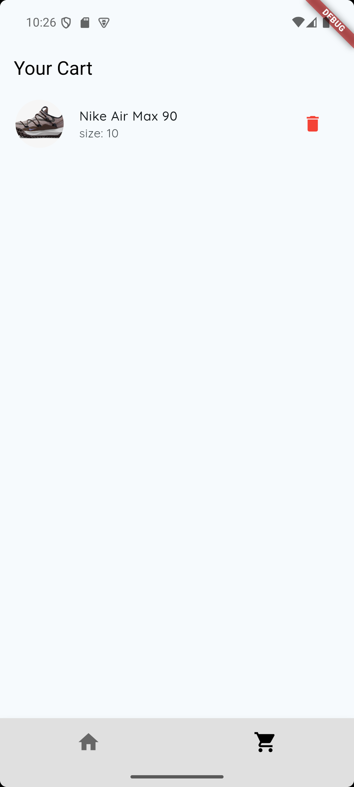

# Shoe Shop

A Flutter-based shoe shop application that allows users to browse products, add them to a cart, and view the cart.

## Features

- Browse a list of shoes
- View detailed information about each shoe
- Add shoes to the cart
- Remove shoes from the cart
- View the cart with all added shoes

## Snips
   

## Getting Started

### Prerequisites

- Flutter SDK: [Install Flutter](https://flutter.dev/docs/get-started/install)
- Dart SDK: Included with Flutter

### Installation

1. Clone the repository:

   ```bash
   git clone https://github.com/arpanz/shoe_shop.git
   cd shoe_shop
